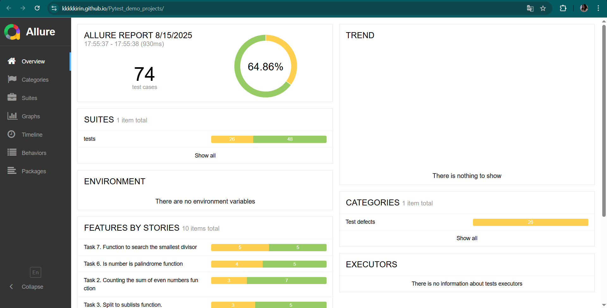

# Pytest Demo Projects

## Описание 

Это проект, содержит в себе решение тестовых заданий, написанных с использованием библиотеки Pytest. 
Он был создан для практики и улучшения навыков тестирования в Python с применением Pytest, и генерации отчетов с помощью библиотеки Allure. 
Задачи для тестирования были взяты с сайта - https://habr.com/ru/articles/791048/.

Пример отчетов представлен на рисунке ниже.

Также, в этом проекте в качестве практики была реализована система непрерывной интеграции и непрерывной доставки (CI/CD) с помощью GitHub Actions.
Конфигурация CI/CD осуществляется через файл `.github/workflows/run_tests.yml`, где я настроил необходимые параметры для запуска тестов.

## Description

This project contains a solution to test problems written using the Pytest library. 
It was created to practice and improve Python testing skills using Pytest and generation reports with using library Allure.
The tasks for testing were taken from the site - https://habr.com/ru/articles/791048/.

The example of reports is down below.

Also, in this project, as a practice, a continuous integration and continuous delivery (CI/CD) system was implemented using GitHub Actions. 
CI/CD configuration is carried out through the `.github/workflows/run_tests.yml` file, where I configured the necessary parameters for running tests.

